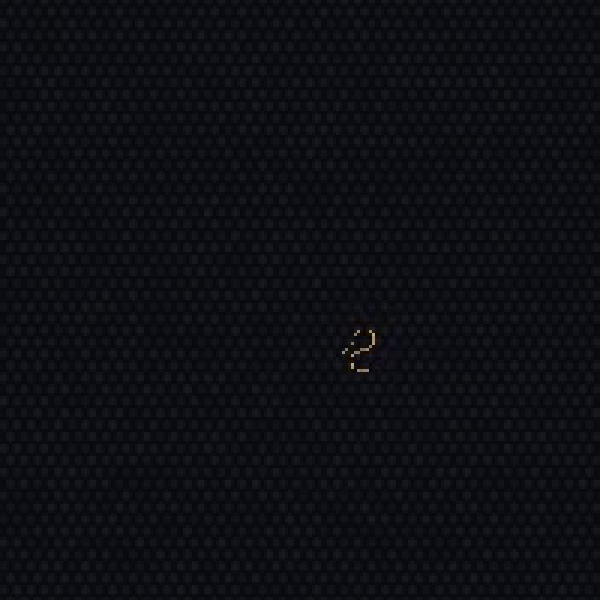
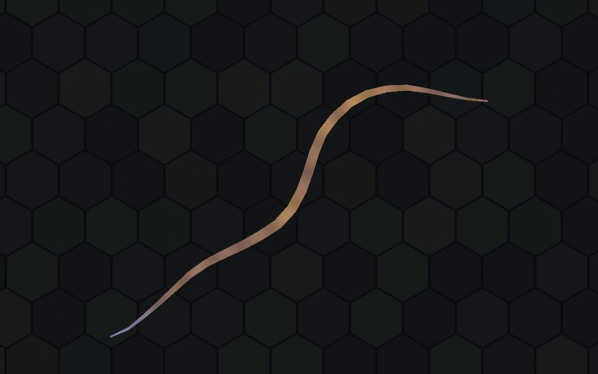

# Wormy


A C. elegans body + nervous system simulation. The real 401-neuron connectome
([Cook et al. 2019](https://doi.org/10.1038/s41586-019-1352-7)) drives a
physically simulated body through resistive-force-theory drag on an
anisotropic substrate — no scripted locomotion, movement is a straight
physical consequence of neural activity acting on body curvature. Built on
[Tessera](https://github.com/wonfeel/Tessera).





## What it does

- Loads the real C. elegans connectome (401 neurons, chemical + gap-junction
  synapses) into a sparse non-spiking network integrator
- One-directional pipeline: network activity → muscle curvature → segmented
  body → RFT physics → position/heading — nothing shortcuts this chain
- Live ImGui panels for network gains, locomotion parameters, per-neuron
  activity, body-angle profile (press **F10** to hide them for a clean view,
  **F9** to record a clip)
- `tests/worm_*_calibration` — calibration/validation harnesses, findings
  (including negative ones) documented alongside the code

## Build

```bash
cmake -S . -B out/build -G Ninja
cmake --build out/build --target Demo_worm
```

The `FetchContent` call in `CMakeLists.txt` grabs
[Tessera](https://github.com/wonfeel/Tessera) at configure time — no manual
clone, no extra setup beyond Tessera's own toolchain (Windows + MSVC).

## Docs

- [WORM.md](demo/worm/WORM.md) — full reference: network model, body physics,
  every `WormSim::Params` field
- [NEURONS.md](demo/worm/NEURONS.md) — neuron naming/nomenclature
- [docs/journal/](docs/journal/) — calibration history, one report per phase
  (V2 through V5). Half of them are negative results: things that were tried,
  measured, and reverted, with the numbers that killed them.
